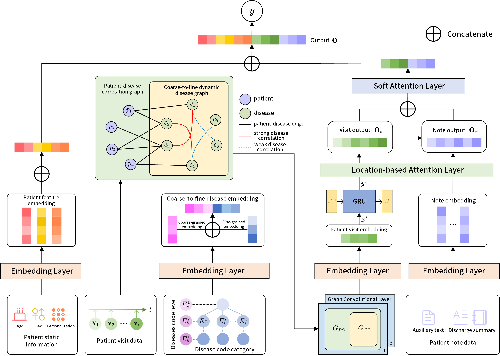

# CCDLD

This is the code implementation of paper "Collaborative Coarse-to-fine Disease Learning with Discharge-summary-aware for EHR Event Prediction".



# Requirements

## Recommend setup

- CPU performance ≥ Intel(R) Xeon(R) Platinum 8255C CPU
- GPU memory ≥ 10GB
- RAM ≥ 32GB
- SSD capacity ≥ 30GB

## Packages

- python 3.8
- tensorflow 2.5.0
- numpy
- sklearn
- pandas
- nltk

## Prepare the environment

1. Install all required packages.

```bash
pip install -r requirements.txt
```

2. In the python console, download the `stopwords` and `punkt` corpus required by `nltk`.

```python
import nltk


nltk.download('stopwords')
nltk.download('punkt')
```

## Download the MIMIC-III and MIMIC-IV dataset

Go to [https://mimic.physionet.org/](https://mimic.physionet.org/gettingstarted/access/) for access. If you have the authority for the dataset, download the dataset and extract the csv files to `data/mimic3/raw/` and `data/mimic4/raw/` in the project.

# Preprocess the dataset

For MIMIC-III:
```bash
python run_preprocess.py
```
For MIMIC-IV:
```bash
python run_preprocess4.py
```

# Train the model

1. For the medical code prediction task.

For MIMIC-III:
```bash
python train_codes.py
```
For MIMIC-IV:
```bash
python train_codes4.py
```

2. For the heart failure prediction task.

For MIMIC-III:
```bash
python train_hf.py
```
For MIMIC-IV:
```bash
python train_hf4.py
```

3. For the top 5 diseases prediction task.

In run_preprocess.py, change disease code '428' to other disease code, and rebuild the dataset.
